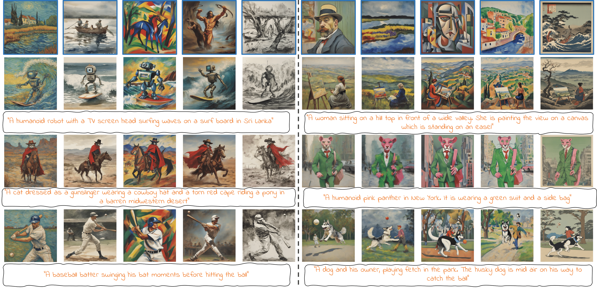
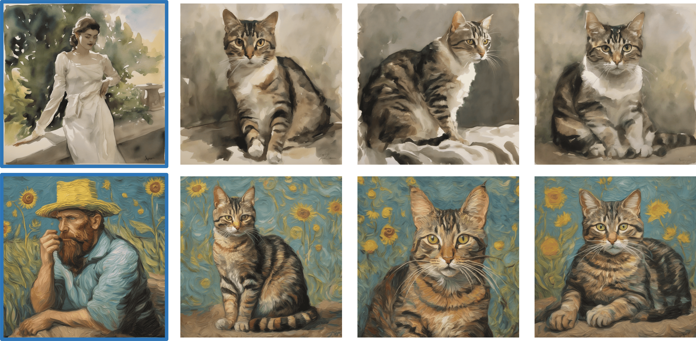
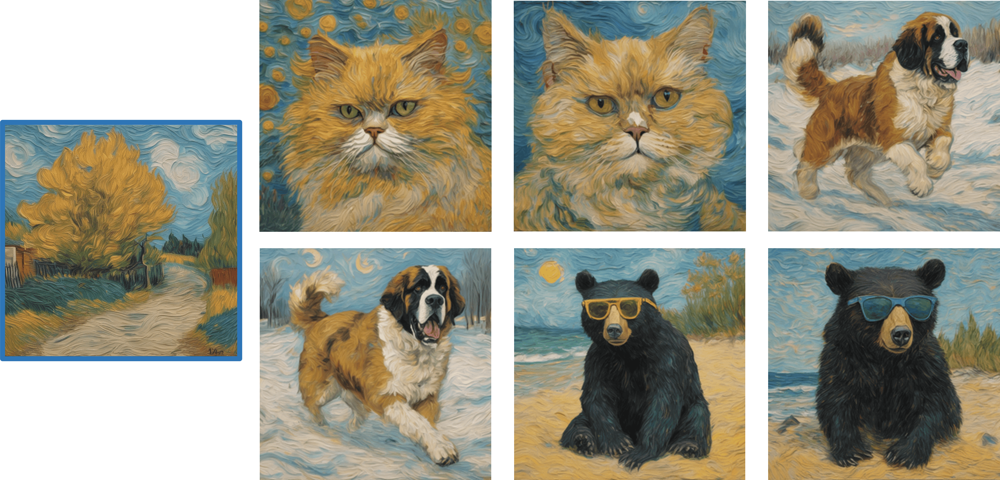
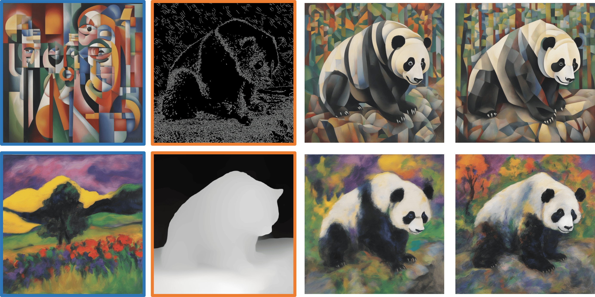
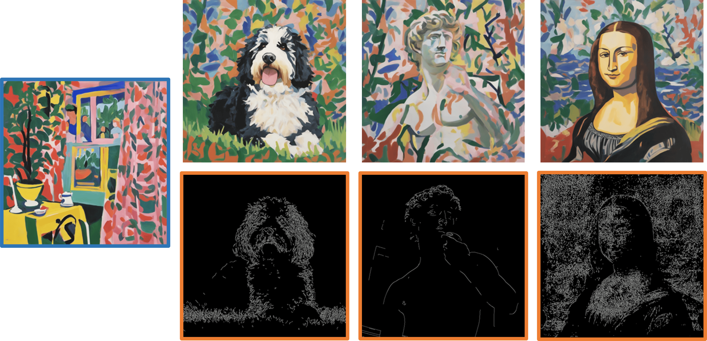

<h1 align="center">
  [CVPR 25] Conditional Balance:  <br>
  Improving Multi-Conditioning Trade-Offs in Image Generation <br>
</h1>

<p align='center'>
<a href="https://nadavc220.github.io/conditional-balance.github.io/"></a>
<a href="https://www.youtube.com/watch?v=WNRcC-fLXq8"></a>
<a href="https://arxiv.org/abs/2412.19853"></a>
<a href="https://pytorch.org/">=2.4.1-Red?logo=pytorch"></a>
</p>


This is the official repository of the paper "Conditional Balance: Improving Multi-Conditioning Trade-Offs in Image Generation" by Nadav Z. Cohen, Oron Nir, and Ariel Shamir.




# Updates
[2025 April] Conditional Balance's SDXL inference code is officially released!

### TODOs
- [x] SDXL balanced inference Code.
- [ ] Analysis Code
- [ ] Stable-Diffusion3.5 balanced Inference Code.

# Environment Setup
We recommend creating a conda environment with the latest library versions. In case issues arise, the library versions used in our experiments are mentioned below.
```
conda create -n conditional_balance python=3.11
conda activate conditional_balance

pip install torch torchvision torchaudio   # version=2.6.0
pip install accelerate                     # version=1.3.0
pip install -U diffusers                   # version=0.32.2
pip install transformers                   # version=4.48.2
pip install einops                         # version=0.8.0
pip install opencv-python                  # version=4.11.0
```

# Inference

### Text Conditioned
The following call can be used to generate text-conditioned images:
```
python style_gen_img.py --seed 25 \
                        --content_prompts "A tabby cat sitting" \
                        --style_prompt "in the style of John Singer Sargent" \
                        --reference_prompt "An watercolor painting" \
                        --lambda_s 0.43 \
                        --num_images_per_prompt 1 \
                        --output_path "outputs" \
                        --initialize_latents
```


### Multi-Text Conditioned
You can also generate text-conditioned images using more than one text condition:
```
python style_gen_img.py --seed 10 \
                        --content_prompts "A persian cat" "A St. Bernard dog running on snow" "A black bear wearing sunglasses on the beach" \
                        --style_prompt "in the style of Vincent van-Gogh" \
                        --reference_prompt "An oil painting" \
                        --lambda_s 0.43 \
                        --num_images_per_prompt 1 \
                        --output_path "outputs" \
```


### ControlNet Conditioned
The following call can be used to generate canny conditioned images. Use the same parameters with "style_gen_img_depth.py" for depth conditioning.
```
python style_gen_img_canny.py --seed 112 \
                              --content_prompts "A panda bear standing on a boulder in the forest" \
                              --style_prompt "in the style of Jean Metzinger" \
                              --reference_prompt "A painting" \
                              --content_image_path "assets/panda.jpg" \
                              --lambda_s 0.57 \
                              --lambda_t 0.8 \
                              --num_images_per_prompt 1 \
                              --output_path "outputs" \
                              --initialize_latents
```

### Multi-ControlNet Conditioned
You can also generate canny conditioned images using multiple cannies. To do this, <content_image_path> should be a path of a directory with the conditioning images. <br>
In this setting, if you use a single content prompt it will be applied to all canny conditionals, otherwise you have to input a prompt to each canny in the inputs folder.
```
python style_gen_img_canny.py --seed 42 \
                              --content_prompts "A bernedoodle sitting on grass" "A marble scalpture of David" "The Mona Lisa "\
                              --style_prompt "in the style of Henri Matisse" \
                              --reference_prompt "A painting" \
                              --content_image_path "assets/conditionals_dir_example" \
                              --lambda_s 0.57 \
                              --lambda_t 0.8 \
                              --num_images_per_prompt 1 \
                              --output_path "outputs" \
                              --initialize_latents
```



# Citation
If you found this project helpful in your research, please consider citing our paper.
```
@misc{cohen2024conditionalbalanceimprovingmulticonditioning,
      title={Conditional Balance: Improving Multi-Conditioning Trade-Offs in Image Generation}, 
      author={Nadav Z. Cohen and Oron Nir and Ariel Shamir},
      year={2024},
      eprint={2412.19853},
      archivePrefix={arXiv},
      primaryClass={cs.CV},
      url={https://arxiv.org/abs/2412.19853}, 
}
```

# Acknowledgments
We wish to thank the authors of [StyleAligned](https://github.com/google/style-aligned) as parts of our code were adopted from their repository.
